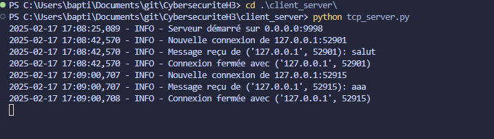
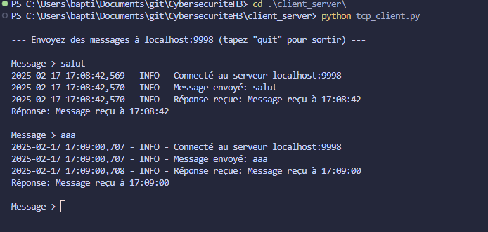

# Serveur et Client TCP en Python

Une implémentation simple d'un serveur TCP multi-threadé et son client en Python, permettant d'échanger des messages avec logging.

## Comment utiliser

1. **Lancer le serveur**
   
   Dans un premier terminal :
   ```bash
   python tcp_server.py
   ```
   Le serveur se met en écoute sur le port 9998.

2. **Lancer le client**
   
   Dans un second terminal :
   ```bash
   python tcp_client.py
   ```
   Vous pouvez maintenant envoyer des messages via l'invite de commande.

## Fonctionnalités

- Serveur TCP multi-threadé
- Logging détaillé des connexions et messages
- Mode interactif pour le client
- Support des messages texte et JSON
- Gestion propre des connexions et des erreurs

## Commandes de test

Test avec le client Python :
```bash
Message > Votre message
```

Test avec curl :
```bash
curl -X POST http://localhost:9998 -d "Message de test"
```

## Prérequis

- Python 3.x
- Aucune bibliothèque externe requise

## Notes

- Le serveur écoute par défaut sur `0.0.0.0:9998`
- Le client se connecte par défaut à `localhost:9998`
- Tapez 'quit' dans le client pour quitter
- Utilisez Ctrl+C pour arrêter le serveur 