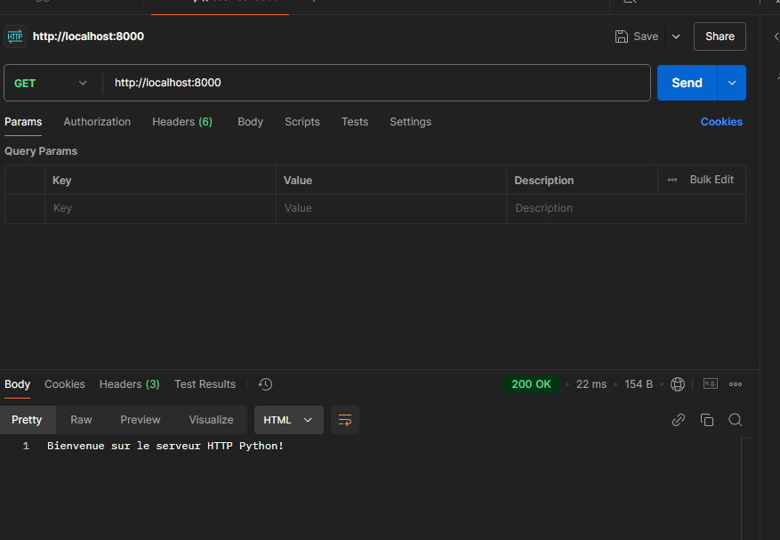

# Serveur HTTP Python Simple

Une implémentation basique d'un serveur HTTP en Python avec support des requêtes GET et POST.

## Démarrage du serveur

1. **Lancer le serveur**
   
   ```bash
   python simple_server.py
   ```
   Le serveur démarre sur le port 8000.

## Test avec Postman

### 1. GET /

- URL : `http://localhost:8000`
- Méthode : GET
- Réponse attendue : "Bienvenue sur le serveur HTTP Python!"

### 2. GET /api

- URL : `http://localhost:8000/api`
- Méthode : GET
- Réponse attendue : JSON avec message et status

### 3. POST /

- URL : `http://localhost:8000`
- Méthode : POST
- Headers : 
  - Content-Type: application/json
- Body (raw JSON) :
  ```json
  {
      "message": "test 123"
  }
  ```

## Routes disponibles

- `GET /` : Page d'accueil
- `GET /api` : Retourne des données JSON
- `POST /` : Accepte des données JSON

## Test avec curl

```bash
# Test GET
curl http://localhost:8000

# Test GET /api
curl http://localhost:8000/api

# Test POST
curl -X POST http://localhost:8000 \
     -H "Content-Type: application/json" \
     -d '{"message":"Hello"}'
```

## Fonctionnalités

- Serveur HTTP basique
- Support des requêtes GET et POST
- Réponses en HTML et JSON
- Compatible avec Postman et autres clients HTTP

## Prérequis

- Python 3.x
- Module requests (`pip install requests`) 