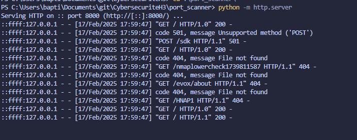

# Scanner de Ports Python

Un scanner de ports multi-threadé en Python utilisant nmap pour l'analyse et lsof pour les informations sur les processus.

## Installation

1. **Prérequis**
   ```bash
   sudo apt-get install nmap
   sudo apt-get install lsof
   pip install python-nmap
   ```

2. **Lancer le serveur de test**
   
   ```bash
   python3 -m http.server
   ```

3. **Lancer le scan**
   
   ```bash
   python port_scanner.py -t 127.0.0.1 -sp 8000 -ep 8010
   ```

## Résultats

1. **Scan simple**
   
   ```bash
   python port_scanner.py -t localhost
   ```

## Options disponibles

- `-t, --target` : Adresse IP cible (défaut: localhost)
- `-sp, --start-port` : Port de début (défaut: 1000)
- `-ep, --end-port` : Port de fin (défaut: 8000)
- `-p, --process` : Afficher les infos des processus
- `-o, --output` : Fichier de sortie JSON
- `-th, --threads` : Nombre de threads (défaut: 10)

## Exemple de sortie JSON

```json
{
    "host": "127.0.0.1",
    "ports": [
        {
            "port": 8000,
            "state": "open",
            "process": {
                "pid": "12345",
                "name": "python3",
                "location": "/home/user",
                "command": "python3 -m http.server"
            }
        }
    ]
}
```

## Notes

- Nécessite des privilèges sudo pour lsof
- Utilise nmap pour le scan des ports
- Multi-threadé pour de meilleures performances 