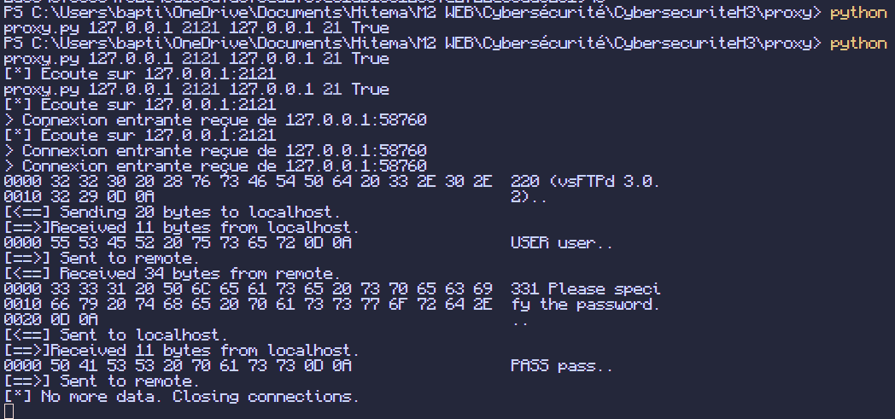

# Proxy TCP Python

Un proxy TCP permettant d'intercepter et d'analyser le trafic réseau entre un client et un serveur, particulièrement utile pour le débogage et les tests de sécurité, notamment avec FTP.

## Installation

1. **Prérequis**
   ```bash
   # Aucune dépendance requise (bibliothèque standard Python uniquement)
   ```

2. **Lancer le proxy**
   ```bash
   python proxy.py 127.0.0.1 2121 127.0.0.1 21 True
   ```

3. **Tester avec FTP**

   Dans un autre terminal, lancez le serveur FTP avec Docker :
   ```bash
   docker run -d -p 21:21 -p 21000-21010:21000-21010 -e FTP_USER=user -e FTP_PASS=pass fauria/vsftpd
   ```

   Puis lancez le client de test :
   ```bash
   python test_client.py
   ```

## Résultats

1. **Exemple de capture FTP**
   ```
   [*] Écoute sur 127.0.0.1:2121
   > Connexion entrante reçue de 127.0.0.1:64332
   0000 32 32 30 20 28 76 73 46 54 50 64 20 33 2E 30 2E  220 (vsFTPd 3.0.
   0010 32 29 0D 0A                                      2)..
   [<==] Sending 20 bytes to localhost.
   ```
   

2. **Structure du projet**
   ```
   proxy/
   ├── proxy.py        # Script principal du proxy
   ├── test_client.py  # Client FTP de test
   └── README.md       # Documentation
   ```

## Fonctionnalités

- Interception du trafic TCP bidirectionnel
- Affichage hexadécimal des données
- Support des protocoles nécessitant une initialisation (comme FTP)
- Gestion multi-thread des connexions
- Possibilité de modifier les paquets en transit

## Options disponibles

- `localhost` : Adresse d'écoute du proxy
- `localport` : Port d'écoute du proxy
- `remotehost` : Adresse du serveur distant
- `remoteport` : Port du serveur distant
- `receive_first` : `True` si le serveur envoie des données en premier (comme FTP)

## Test avec différents clients

### 1. Client Python fourni

### 2. Client FTP en ligne de commande
```bash
ftp 127.0.0.1 2121
# Utilisateur: user
# Mot de passe: pass
```

### 3. FileZilla ou autre client FTP
- Hôte : 127.0.0.1
- Port : 2121
- Utilisateur : user
- Mot de passe : pass

## Notes

- Vérifiez les pare-feu et logiciels de sécurité
- Assurez-vous d'avoir les permissions nécessaires
- Attention aux ports déjà utilisés
- Utilisez uniquement sur des réseaux autorisés
- Fonctionne mieux sur Linux/Unix mais compatible Windows