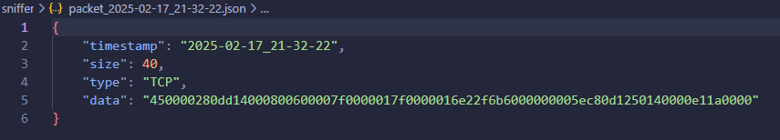

# Sniffer Réseau Python

Un sniffer réseau simple en Python qui capture les paquets ICMP et les sauvegarde au format JSON.

## Installation

1. **Prérequis**
   ```bash
   python3 -m pip install -r requirements.txt
   ```

2. **Lancer le sniffer**
   
   ```bash
   sudo python3 network_sniffer.py
   ```

3. **Tester la capture**

   Dans un autre terminal :
   ```bash
   ping localhost
   ```

## Résultats

1. **Fichiers de sortie**
   
   - Logs dans `sniffer.log`
   - Paquets dans `packet_*.json`

2. **Exemple de capture**
   
   ```json
   {
       "timestamp": "2024-02-17_15:30:45",
       "source": "127.0.0.1",
       "port": 0,
       "data": "450000..."
   }
   ```

## Fonctionnalités

- Capture des paquets ICMP
- Logging détaillé
- Sauvegarde au format JSON
- Support IPv4

## Notes

- Nécessite des privilèges sudo
- Capture uniquement les paquets ICMP
- Fonctionne mieux sur Linux/Unix 