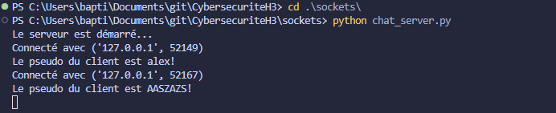
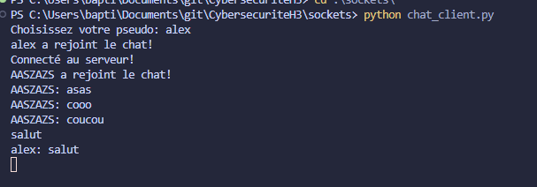
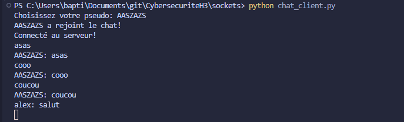

# Chat Application avec Python Sockets

Une application de chat simple utilisant les sockets Python permettant à plusieurs utilisateurs de communiquer en temps réel.

## Comment utiliser

1. **Lancer le serveur**
   
   Ouvrez un terminal et exécutez :
   ```bash
   python chat_server.py
   ```

2. **Lancer le premier client**
   
   Dans un nouveau terminal :
   ```bash
   python chat_client.py
   ```
   Entrez votre pseudo quand demandé.

3. **Lancer le deuxième client**
   
   Dans un autre terminal :
   ```bash
   python chat_client.py
   ```
   Entrez un pseudo différent.

## Fonctionnalités

- Chat en temps réel
- Support de plusieurs clients simultanés
- Notification quand un utilisateur rejoint ou quitte le chat
- Interface en ligne de commande simple

## Prérequis

- Python 3.x
- Aucune bibliothèque externe requise
